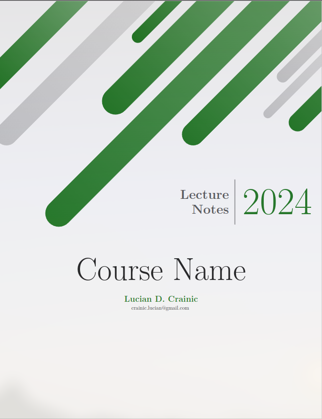
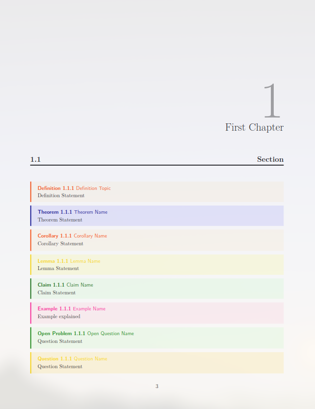
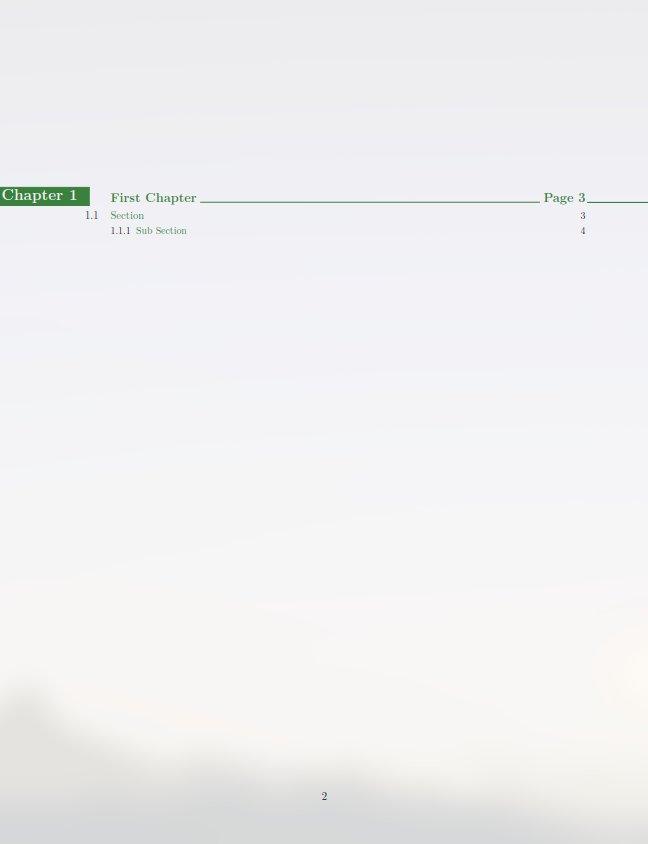
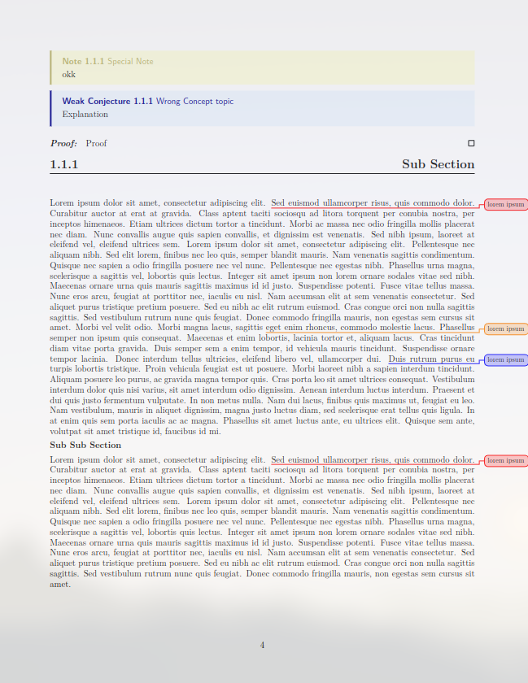

# LaTeX Templates

This repository provides a LaTeX template for creating cheatsheets and lecture notes.

## Cheatsheet Template

The `cheatsheet.tex` file contains a basic structure for creating cheatsheets. It is designed to be concise and easy to navigate. You can add your content and customize the layout as needed.

## Lecture Notes Template

The `notes.tex` file provides a template for organizing lecture notes. It includes sections for topics, subtopics, and examples. You can easily add your own content and modify the formatting to suit your needs.

  
  

  
  

Feel free to use these templates as a starting point for your own projects. Happy note-taking!
